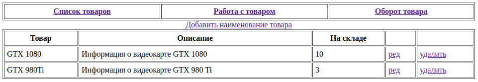
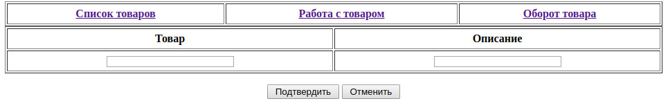
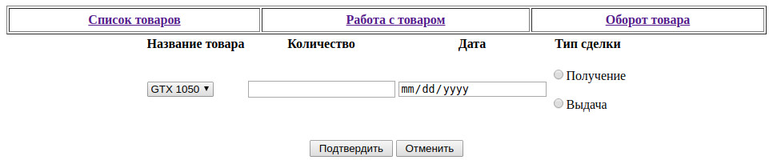
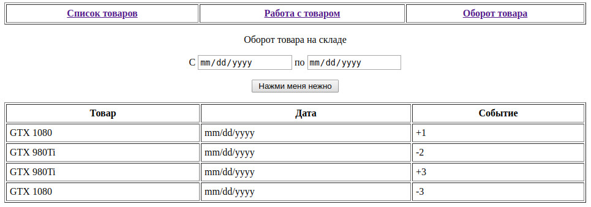

Учет товара на складе
-

Видение
 
Требуется Web приложение для учета товара на складе. 

Приложение должно реализовывать следующие функции: 
- Пользователь может просматривать товары, которые есть на складе;
- Пользователь может добавлять новые наименования товаров;
- Пользователь может удалять или редактировать существующие наименования товаров;
- Пользователь может получать товары на склад;
- Пользователь может выдавать товары со склада;
- Пользователь может просмотреть оборот товаров за указанный промежуток времени.

**1 Просмотр каталога товаров**

Данный режим программы предназначен для просмотра каталога товаров.

    Основной сценарий:
    - Пользователь выбирает пункт меню «Список товаров»;
    - Отображается форма просмотра списка товаров;

В списке отображаются следующие колонки:
- Товар – наименование товара;
- Описание – описание товара;
- На складе – количество товара, соответствующего наименования, на складе.

На форме присутствуют следующие кнопки:
- «Добавить наименование товара» - кнопка открытия формы добавления нового товара;
- «ред» - кнопка редактирования товара;
- «удалить» - кнопка удаления товара.

**2 Добавление/редактирование наименования товара**

Данный режим работы программы предназначен для добавления новых наименований товаров либо редактирования существующих.

	Сценарий добавления наименования товара:
	- Пользователь, находясь в режиме просмотра формы списка товаров нажимает кнопку «Добавить наименование товара»;
	- Отображается форма добавления наименования товара;
	- Пользователь вводит название и описание товара;
	- Пользователь нажимает кнопку подтвердить.
	- Если произошла ошибка добавления данных, то выводиться сообщение «Ошибка сохранения данных»;
    - Если данные о заказе успешно добавлены, то выводится сообщение «Запись успешно добавлена».
    
    
    Сценарий редактирования наименования товара:
	- Пользователь, находясь в режиме просмотра формы списка товаров нажимает кнопку «ред» у соответствующего товара;
	- Отображается форма редактирования наименования товара;
	- Пользователь вводит название и описание товара;
	- Пользователь нажимает кнопку подтвердить.
	- Если произошла ошибка добавления данных, то выводиться сообщение «Ошибка сохранения данных»;
    - Если данные о заказе успешно добавлены, то выводится сообщение «Запись успешно добавлена».

Пользователю отображаются два поля для ввода данных:
- Товар - название товара;
- Описание - описание товара.

**3 Удаление товара**
Данный режим работы программы предназначен для удаления наименования товара.
    
    Сценарий удаления наименования товара:

    - Пользователь находясь в режиме просмотра списка товаров нажимает кнопку «удалить»;
    - Отображается форма подтверждения удаления;
    - Пользователь подтверждает удаление;
    - Если произошла ошибка удаления данных, то выводиться сообщение «Ошибка удаления данных»;
    - Если данные успешно удалены, то выводится сообщение «Запись успешно удалена»;
    - Отображается форма просмотра списка товаров на складе.

**4 Прием/отпуск товара**

Данный режим работы программы предназначен для добавления на склад новых товаров либо отпуска товаров со склада.

	Сценарий добавления товара:

    - Пользователь нажимает кнопку «Работа с товаром»;
    - Отображается форма работы с товарами;
    - Пользователь выбирает получение товара;
    - Пользователь вводит название, количество и дату получения товара.
    - Пользователь нажимает кнопку «Подтвердить» для добавления записи о товаре на склад;
    - Если произошла ошибка добавления данных, то выводиться сообщение «Ошибка сохранения данных»;
    - Если данные о заказе успешно добавлены, то выводится сообщение «Запись успешно добавлена».

	Сценарий выдачи товара:
    
    - Пользователь нажимает кнопку «Работа с товаром»;
    - Отображается форма работы с товарами;
    - Пользователь выбирает выдачу товара;
    - Пользователь вводит название, количество и дату выдачи товара.
    - Пользователь нажимает кнопку «Подтвердить» для добавления записи о выдаче  товара со склада;
    - Если на складе нет указанных товаров, выводится сообщение «Отсутствует указанный товар»;
    - Если на складе недостаточно указанного товара, выводится сообщение «Недостаточно указанного товара»;
    - Если произошла ошибка добавления записи о выдаче товара, то выводиться сообщение «Ошибка сохранения данных»;
    - Если данные о выдаче товара успешно добавлены, то выводится сообщение «Запись успешно добавлена».

При приеме/выдаче товара вводятся следующие реквизиты:
- Название товара – название добавляемого/выдаваемого товара;
- Количество – количество добавляемого/выдаваемого товара;
- Дата получения – дата получения/выдачи товара;
- Получить/выдать – блок указания характера работы с товаром.

    Сценарий отмены изменений:
    - Пользователь, нажимает кнопку «Работа с товаром»;
    - Отображается форма работы с товарами;
    - Пользователь вводит название, количество и дату, выбирает выдачу/получение товара;
    - Пользователь нажимает кнопку «Отменить»;
    - Отображается форма «Список товаров».
    
**5 Оборот товара**

Данный режим программы предназначен для просмотра оборота товара в указанный промежуток времени.

	Основной сценарий:

    - Пользователь выбирает пункт меню «Оборот товара»;
    - Отображается форма просмотра оборота товаров;
    - Пользователь обозначает временные рамки и нажимает кнопку «Filter»;
    - Пользователю отображается наименования товаров и количество выданного и принятого товара.
    

При просмотре оборота товара вводятся следующие реквизиты:
- "с" – вводится дата, для вывода заказов начиная с указанной даты и по текущий момент;
- "по" – вводится дата, для вывода заказов, начиная с момента запуска системы и по указанную дату;
- Заказы "с" … "по" – вводятся две даты, для вывода заказов в указанный промежуток времени.